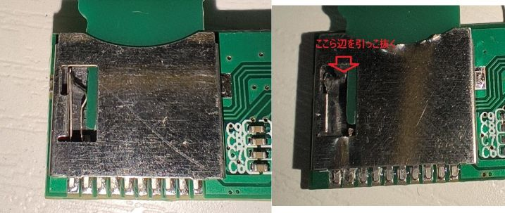

# ラズパイ5のマイクロSDカードをリモートで書き換えたり、リモートで電源ONにできるやつ

## できること
- マイクロSDカードの接続をラズパイとUSBカードリーダーで切り替えられる
    - 接続の切り替え部分は[これ](https://x.com/task_jp/status/1864548270422573205)の真似
- 電源ボタンを押したのと同じことができる
    - [この資料](https://www.raspberrypi.com/documentation/computers/raspberry-pi.html#add-your-own-power-button)の通りに制御する
- 電源の状態を知れる
    - マイクロSDに供給されている電源を監視
- PCとUSB-UART的なもの（正確にはUSB CDC ACM）で繋ぐ
    - CH552マイコンを使って制御している

## 使い方
こんな感じに組み立てます  
USB-UARTもあったほうが便利です  


ラズパイの電源を入れる前にUSBハブをPCに繋ぎます  
ターミナルの表示は以下  
この状態ではPCからuSDカードにアクセスできます  
```
Raspberry Pi Remote
USB Card Reader
USB> 
```

`rpi`を入力してuSDの接続をラズパイに切り替えます  
この状態ではPCからuSDカードにアクセスできません  
```
USB> rpi
Raspberry Pi
Pi Off>
```

ラスパイの電源を入れて、ターミナルでエンターを入力すると下のような表示になります  
```
Pi Off>
Undefined Command
Pi On>
```

ラスパイをシャットダウンして、ターミナルでエンターを入力すると下のような表示になります  
```
Pi On>
Undefined Command
Pi Off>
```

`pon`を入力してラズパイの電源をONにします  
ターミナルでエンターを入力すると下のような表示になります  
```
Pi Off> pon
Power ON
Pi Off>
Undefined Command
Pi On>
```

`Pi Off`の状態から`usb`コマンドを入力すると、PCからuSDカードにアクセス出来るようになります  
```
Pi Off> usb
USB Card Reader
USB>
```

`Pi On`状態で`shutdown`コマンド実行で、強制的にラズパイの電源をOFFにできます（OSのシャットダウンではありません）  
その後、PCからuSDカードにアクセス出来るようになります  

## 部品
- [USBハブ](https://ja.aliexpress.com/item/1005007046850790.html?spm=a2g0o.order_list.order_list_main.20.7e81585a35DO0V&gatewayAdapt=glo2jpn)
- [USBカードリーダー](https://ja.aliexpress.com/item/1005007634731826.html?spm=a2g0o.order_list.order_list_main.30.7e81585a35DO0V&gatewayAdapt=glo2jpn)
- [USBエクステンションアダプター](https://ja.aliexpress.com/item/1005007404846946.html?spm=a2g0o.order_list.order_list_main.35.7e81585a35DO0V&gatewayAdapt=glo2jpn)
    - コの字型でUSB3.0のやつ
- 自作の基板
    - 設計データはKiCadディレクトリ以下
    - 基板の厚さは0.8mm

### 基板に乗せる部品
- [CH552](https://ja.aliexpress.com/item/1005004508033849.html?spm=a2g0o.order_list.order_list_main.5.138b585aBJw2jm&gatewayAdapt=glo2jpn)
    - CH552T
- [tmux1574pwr](https://ja.aliexpress.com/item/1005007848132137.html?spm=a2g0o.order_list.order_list_main.15.138b585aBJw2jm&gatewayAdapt=glo2jpn)
- [1N5819 SOD-123](https://ja.aliexpress.com/item/1005003194674618.html?spm=a2g0o.order_list.order_list_main.20.138b585aBJw2jm&gatewayAdapt=glo2jpn)
- [XC6206P332MR](https://ja.aliexpress.com/item/1005002918096822.html?spm=a2g0o.order_list.order_list_main.5.5ee2585acfyiWX&gatewayAdapt=glo2jpn)
- [ボタン](https://ja.aliexpress.com/item/32756768334.html?spm=a2g0o.productlist.main.13.1a30k3VJk3VJE4&algo_pvid=fc0dd005-b246-4df2-92c3-029a18e87beb&algo_exp_id=fc0dd005-b246-4df2-92c3-029a18e87beb-6&pdp_npi=4%40dis%21JPY%2184%2184%21%21%210.53%210.53%21%402101590d17375500547186651ede79%2164666626003%21sea%21JP%212693366707%21X&curPageLogUid=l37UiVKB93k7&utparam-url=scene%3Asearch%7Cquery_from%3A)
    - 買ったやつはリンクなくなった・多分これと同じ
- 抵抗とか容量は1206サイズ（3.2mmx1.6mm）

## 基板の繋ぎ方
### 作成した基板の実装
こんな感じ  
  


uSDカードスロットのフットプリントはギリギリ使えるくらいにずれています

### SDカードリーダーの改造
カードリーダーの基板を取り出します  


uSDスロットのカードデテクトを壊します  
カードを入れてもdetectピンがグランドに落ちないようにします  


カードリーダーのSDスロットを外します  
外したソケットのパターンのデテクトピンと作成した基板のTP1を繋ぎます  


### ピンヘッダ(J2)の接続
- 1PINはPSWピンヘッダの1PIN
- 2PINはPSWピンヘッダの2PIN (GND)
- 3PINはラズパイピンヘッダの5V出力
    - 電源はUSBからもとっているので、この接続がなくても動きます


## CH552のソフト
[ch55xduino](https://github.com/DeqingSun/ch55xduino)を使って、CH552にArduino IDEからプログラム(Arduino/SDSEL/SDSEL.ino)を書きみます  
プログラムの書き込みには[WCHISPTool](https://www.wch.cn/downloads/WCHISPTool_Setup_exe.html)が必要です